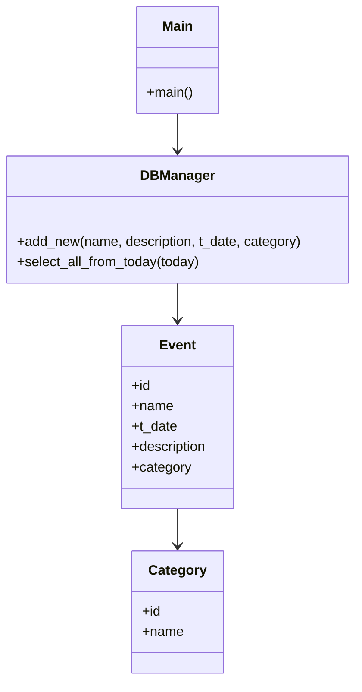

# PythonDBManager  
A simple Python 🐍 application to manage a database 💾 via MySQL.  

This project is a **command-line event planner**:  
- Create, update, and manage events with categories.  
- Automatically check today’s events on startup using Python’s `datetime`.  
- Store data persistently in a MySQL database.  
- Database schema and sample data are provided via `dbconfig.sql`.  

This project was made using **PyCharm**, so you can clone the entire project in it.

---

## 📂 Project Structure
```
.
├── DBManager.py             # Handles database connection + CRUD
├── main.py                  # Entry point, CLI logic
├── dbconfig.sql             # Schema + sample data
├── ConnectionVariables.json # User-specific DB credentials
└── README.md
```

---

## ⚙️ Requirements
- Python 3.10+  
- MySQL 8+  
- Dependencies:
  ```bash
  pip install mysql-connector-python
  ```

---

## 🚀 Setup
1. Clone this repository:
   ```bash
   git clone https://github.com/<your-username>/PythonDBManager.git
   cd PythonDBManager
   ```

2. Configure your MySQL credentials in `ConnectionVariables.json`:
   ```json
   {
     "host": "localhost",
     "user": "your_username",
     "password": "your_password",
     "database": "PlannedEvents"
   }
   ```

3. Run the project:
   ```bash
   python main.py
   ```

The database and tables will be initialized automatically from `dbconfig.sql`.  

---

## 🗄️ Database Schema
The project uses two tables:  

**Category**  
- `id` (PK)  
- `name`  

**Event**  
- `id` (PK)  
- `name`  
- `t_date` (`DATETIME`)  
- `description`  
- `category` (FK → Category.id)  

Sample schema (`dbconfig.sql`) also includes a few test categories and events.

---

## 📊 UML Diagram


---

## 📌 Features
- 📅 **Auto-check today’s events** at startup.  
- ➕ **Add new events** with optional description and category.  
- 🔍 **List today’s events** with category info.  
- 🗄️ **MySQL-backed persistence** with provided schema and sample data.  

---

## 🔮 Future Improvements
- CLI menu to create/update/delete events.  
- More queries (find by name, find by date range).  
- PyQt5 GUI for a graphical interface.  
